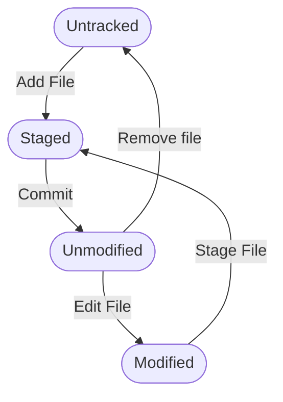

# VCS (Version Control System) - Система Контроля Версий

## Git

**Git** - это распространенная система управления версиями, которая помогает разработчикам отслеживать и контролировать все изменения в коде.
Он позволяет обмениваться кодом и _ковать_ проекты в команде.
Git позволяет создавать _ветки_ для разработки новых функций, исправления ошибок и так далее, а затем сливать эти изменения обратно в основную ветку.

## Github

**GitHub** - это платформа для хостинга репозиториев Git. Он предоставляет централизованное место для хранения репозиториев, доступ к которым можно получить из любого места.
GitHub предлагает инструменты для совместной работы, такие как системы отслеживания ошибок, запросы на вытягивание, инструменты для код-ревью и управления проектами.

---

# Основные шаги по работе с Git и GitHub

1. Создание репозитория на GitHub:
**Репозиторий** - это место где хранится ваш проект. Он содержит все файлы проекта и каждую сохраненную версию этих файлов

2. Клонирование репозитория:
Это означает скачивание копии репозитория на ваш локальный компьютер.

3. Создание ветки:
**Ветка** - это параллельная версия репозитория. Она содержит свою версию файлов проекта, которую вы можете изменять без влияния на основную ветку.

4. Внесение изменений и создание коммитов:
**Коммит** - это сохранение ваших изменений. Каждый коммит содержит сообщение с описанием внесенных изменений.

5. Отправка изменений (push):
Это означает отправку ваших коммитов из локального репозитория на GitHub.

6. Создание запроса на вытягивание (Pull Request):
Запрос на вытягивание начинает обсуждение ваших изменений. Другие участники могут просмотреть ваши изменения, обсудить их и предложить модификации.

7. Слияние (merge):
После обсуждения и проверки вашего запроса на вытягивание, вы можете объединить свои изменения с основной веткой.

---

Это обазовый рабочий процесс Git и GitHub, но есть много других функций и возможностей которые можно использовать


## Hash

**Хеш коммита (хэш коммита, commit hash)** — это специальная метка, позволяющая отличать одни коммиты от других.

Хеш коммита состоит из _40_ символов, в составе могут быть как буквы, так и цифры.

*Пример хеша коммита: d1cw4e2bd74e03ajj732assb476392ff77f24e47*

1. Чтобы узнать хеш последнего коммита, нужно ввести команду:

```shell
$ git rev-parse HEAD
```

2. Чтобы узнать хеш определенного коммита, например, первого, нужно ввести команду:

```shell
$ git log -n 1 --pretty=format:"%H"
```
3. Чтобы узнать хеш последнего коммита в нужной ветке:

```shell
git show-ref --heads --hash master
```

---

## Git log

**Git log** — разнообразная информация о коммитах в целом, по отдельным файлам и различной глубины погружения в историю.
Иногда требуется получить информацию об истории коммитов, коммитах, изменивших отдельный файл; коммитах за определенный отрезок времени и так далее.
Для этихцелей используется команда:

```shell
$ git log
```

Если вас не устраивает формат git log по умолчанию, то для любого из описанных ниже вариантов форматирования можно создать ярлык с помощью псевдонимов git config. О настройке псевдонимов читайте в разделе, посвященном команде git config.

### Однострочный формат git log

Флаг *--oneline* записывает каждый коммит в одну строку. По умолчанию отображаются только идентификаторы коммитов и первые строки комментариев к ним. Типичный вывод *git log --oneline* выглядит следующим образом:

```shell
0e25143 Merge branch 'feature'
ad8621a Fix a bug in the feature
16b36c6 Add a new feature
23ad9ad Add the initial code base
```

---

## HEAD

**HEAD** в Git-это указатель на текущую ссылку ветви, которая, в свою очередь, является указателем на последний сделанный вами коммит или последний коммит, который был извлечен из вашего рабочего каталога.

Служебная информация о HEAD содержиться в папке *.git/HEAD*. Прочить её можно с помощью:

```shell
$ cat .git/HEAD
ref: refs/heads/master
```

Это просто способ отслеживания текущей позиции в репозитории. Хорошим примером использования HEAD является головка воспроизведения и записи на кассетном магнитофоне. Когда мы начинаем записывать звук, лента проходит мимо головы и записывает на нее данные. Когда мы нажимаем кнопку «Стоп», место, где останавливается эта записывающая головка, также является местом, где она снова начнет запись, если мы нажмем кнопку «Запись» во второй раз.

---

## Git Status

Команда git status отображает состояние рабочего каталога и раздела проиндексированных файлов. С ее помощью можно проверить индексацию изменений и увидеть файлы, которые не отслеживаются Git. Информация об истории коммитов проекта не отображается при выводе данных о состоянии. Для этого используется команда git log. Связанные команды git. git tag Теги — это ссылки, указывающие на определенные точки в истории Git.

### Состояния файлов




| Термин | Пояснение |
|--------|-----------|
| Untracked | Неотслеживаемый |
| Staged | Подготовленный |
| Unmodified | Зафиксированный |
| Add File | Планирование для включения в фиксацию |
| Edit File | Изменение файла |
| Remove file | Удаление файла |
| Commit | Фиксация |